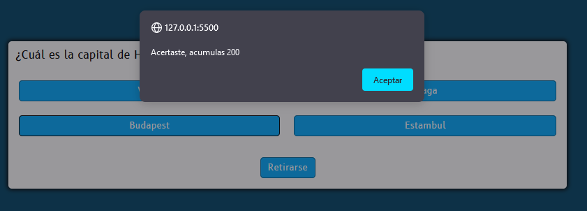

# Concurso de preguntas y respuestas

Conruso sencillo de preguntas, donde podras tener 25 preguntas para resolver con 4 opciones cada una. Cada pregunta tiene un valor de 100 puntos, al final de cada pregunta tendrás la posibilidad de retirarte o continuar respondiendo. Si te retiras te llevas el premio acumulado, de lo contrario pasarás a la siguiente pregunta y en caso de equivocarte perderás todo el acumulado hasta el momento.

Creado con Vanilla Javascript, HTML y CSS

A continuación algunos pantallazos del juego como tal.

## Iniciar Juego

El juego inicia automáticamente se carga la pantalla, luego de ello damos click en "START"

## **Responder las pregunas**

&nbsp;
&nbsp;
&nbsp;

Al elegir una opción, esta validará si es correcta o incorrecta tendras un mensaje como:

- Incorrecta
  
  ### Si es incorrecta la pregunta, el juego aca e inicia nuevamente
  &nbsp;
- correcta
  &nbsp;
  

## **Seguir Jugando**

Damos click en Next

## **Retirarse**

Si deseamos retirarnos, al dar click, inmediatamente nos mostrará nuestro puntaje y finalizará el juego

